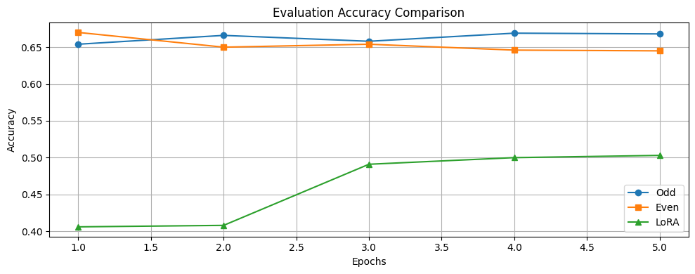
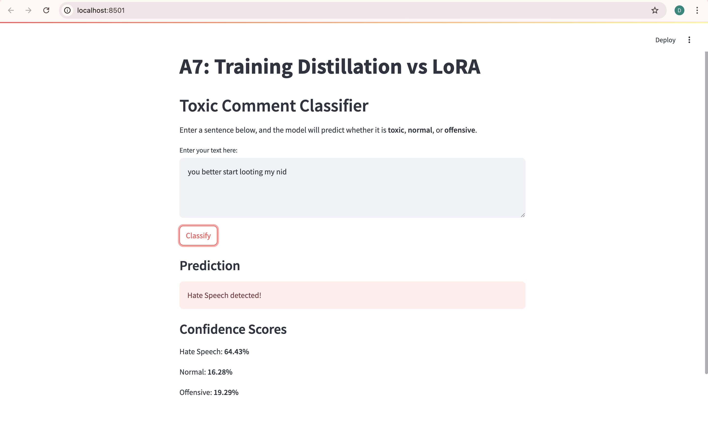
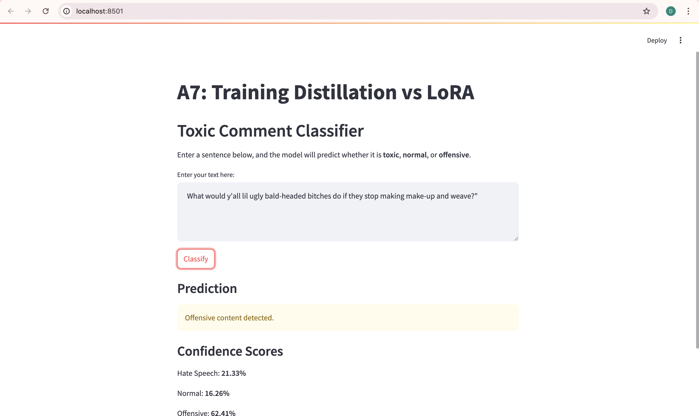
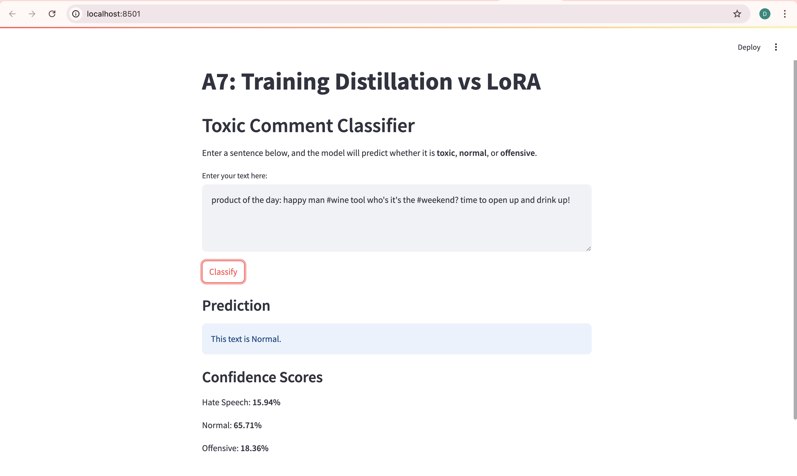
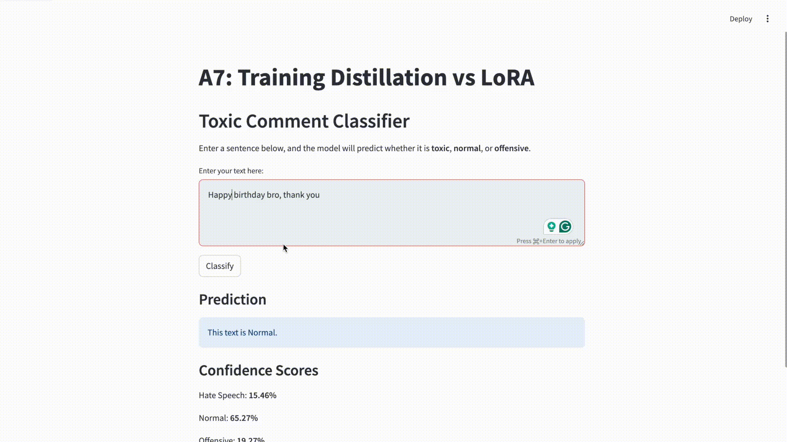

# NLP-A7-Distillation_vs_LoRA
In this assignment, we will explore the comparison between Odd Layer and Even Layer Student Training Models and LoRA (Low-Rank Adaptation) on a distillation task using BERT from Huggingface.

## GitHub Link:
- https://github.com/Nyeinchanaung/NLP-A7-Distillation_vs_LoRA

## Content
- [Student Information](#student-information)
- [Files Structure](#files-structure)
- [How to run](#how-to-run)
- [Dataset](#dataset)
- [Model Training](#training)
- [Evaluation](#evaluation)
- [Web Application](#application)

## Student Information
 - Name     : Nyein Chan Aung
 - ID       : st125553
 - Program  : DSAI

## Files Structure
1) The Jupytor notebook files
- distilBERT.ipynb (https://github.com/Nyeinchanaung/NLP-A7-Distillation_vs_LoRA/blob/main/distilBERT.ipynb)

2) `app` folder  
- app.py (streamlit)

 
## How to run
 - Clone the repo
 - Open the project
 - Open the `app` folder
 - `streamlit run app.py`
 - app should be up and running on `http://localhost:8501/`

## Dataset
HateXplain is a multilingual hate speech dataset containing over 25,000 social media posts annotated by multiple crowdworkers. Each example includes:
- A text post (from Twitter, Reddit, Gab)
- Multiple annotator labels: Hate Speech (0), Normal (1), Offensive (2)
- Rationales: token-level highlights for why the label was chosen
- Target groups (e.g., race, religion, gender)

To prepare labels for training, we apply majority voting over the annotators’ labels in each example. From the annotators`["label"]` field, we extract valid labels (0, 1, or 2) and assign the most frequent one as the final label. If no valid label exists, we default to label 1 (normal). This ensures each input has a single, consistent label for supervised training.

### Source: https://huggingface.co/datasets/Hate-speech-CNERG/hatexplain 

## Training
Base model: `bert-base-uncased`
### Student variants:
- 6-layer student (odd/even)
- 12-layer student with LoRA

### Hyper Parameter
| Hyperparameter    | Value         |
|-------------------|---------------|
|Epochs	            |5              |
|Learning Rate	    |2e-5           |
|Optimizer	        |AdamW          |
|Weight Decay	    |0.01           |
|Scheduler	        |linear         |
|Warmup Steps	    |10% of total steps|
|Loss Functions	    |Classification Loss (CE), KL Divergence, Cosine Similarity|
|Loss Weights	    |avg: (cls + div + cos) / 3 or weighted (0.2, 0.5, 0.3)|
|Evaluation Metric	|F1-score (macro), plus Accuracy, Precision, Recall|
|Device	            |cuda (GPU)  |

## Evaluation

### Result

#### Accuracy Comparison

#### F1 Score

## Application
### Application Development
The web application is a Streamlit-based toxic comment classifier that allows users to input any text and receive real-time predictions. It uses the best-trained BERT student model (e.g., Odd-Layer) to classify the text as Hate Speech, Offensive, or Normal, and displays the result with color-coded alerts and confidence scores for transparency and clarity.
### How to use web app
1) **Run the App:** (In your terminal, navigate to the project folder and run:)
2) **Enter Text:** In the input box, type any sentence or comment you want to analyze.
3) **Click "Classify":** The model will predict whether the text is Hate Speech, Offensive, or Normal.
4) **View Results:** The prediction is shown with a colored alert and confidence scores for each class.

### Screenshots

#### Hate Speech

#### Offensive speech

#### Normal input

#### How to use webapp

## Conclusion